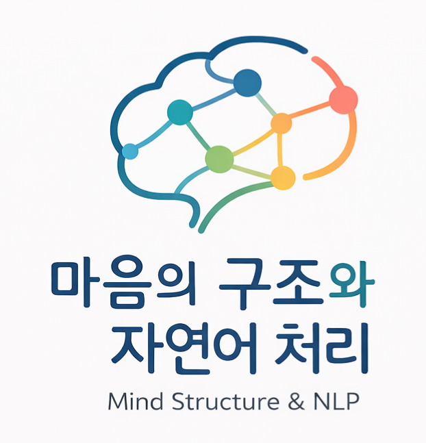

# 전산보건사회학 연구실 (Computational Health Sociology Lab) 소개

작성: 담당 교수 조원광 (2026)

서울대학교 보건대학원 전산보건사회학 연구실은 건강과 질병에 대한 여러 문제를 사회학적 시선으로 탐구합니다. 이를 위해 사회학적 상상력과 자리바꿈의 상상력이 중요하다고 생각하며, 이를 증진하려고 함께 노력합니다. 

### 1. 사회학적 상상력과 보건 의료

이 글에서는 사회학적 상상력을 여러 개체 (개인, 조직 등)의 생각과 행동을 고립된 개체의 특징으로 보지 않고, 그것이 놓여 있는 여러 조건과 맥락, 즉 사회적 관계와 제도, 문화와 역사 속에서 파악하는 능력이라고 이해합니다. 

건강과 질병에 대한 문제를 이해하고 해결하는 일에도 사회학적 상상력이 필요합니다. 예를 들어 환자의 생각과 행동은 질병 자체는 물론, 질병에 부여되는 문화적 의미부터 소득과 보험 제도까지 다양한 맥락에 영향을 받습니다. 

나아가 이런 조건들과 맥락은 다양한 메커니즘으로 작동합니다. 인간관계가 만들어내는 영향력과 소득의 분포가 만들어내는 영향력은, 둘 다 중요하지만, 약간 다릅니다. 이런 조건과 맥락을 섬세하게 구분하고, 각각이 작동하는 메커니즘을 밝힌다면, 건강과 질병에 대한 여러 문제를 이해하고 해결하는 데 기여할 수 있습니다. 

이를 위해 전산보건사회학 연구실은 여러 방법에 관심을 기울이고 있습니다. 전통적인 연구 방법론은 물론이고, 컴퓨터 과학의 여러 아이디어와 방법들을 활용합니다. 예를 들어 자연어 처리(NLP)는 학술 논문, 기사, 리뷰, 온라인 게시판 글 등 다양한 언어 데이터에서 관심 정보를 획득하는 방법이 될 수 있습니다. 전산보건사회학 연구실은 보다 다양한 종류의 데이터, 과거에는 데이터라 여기지 않았던 데이터를 적극적으로 활용하고자 합니다. 이를 통해 복잡한 사회적 조건과 관계를 다양한 각도로 파악할 수 있다고 생각합니다. 

### 2. 자리바꿈의 상상력과 보건 의료

자리바꿈의 상상력은 내 것이 아닌 타인의 조건과 맥락에 자신을 놓아보고, 그의 선택과 행동을 상상해보는 능력을 의미합니다. 누구든 자신이 놓인 조건과 맥락에서 세계를 인지하고 타인을 바라봅니다. 어쩔 수 없는 일이지만, 이것이 때로는 사람들 사이의 이해를 가로막고, 서로를 단순화하는 배경이 됩니다. 타인이 경험하는 제약과 가능성을 알기 어렵기 때문입니다. 그렇기에 완벽하게 타인을 이해할 수 없더라도, 타인의 자리를 상상해 보는 일이 필요합니다. 

보건 의료 영역에서는 더욱 그렇습니다. 보건과 의료는 한편으로는 돌봄이지만, 다른 한편으로는 관리입니다. 치료를 위해 분류하고, 돌보기 위해 관리하게 됩니다. 분류와 관리가 그 자체로 나쁜 것은 아닙니다. 오히려 분류와 관리 없는 치료나 돌봄을 상상하기 어렵습니다. 하지만 동시에 그것의 작동을 면밀히 자각하고 주목하지 않으면, 의도치 않게 타인의 경험을 단순화하고 목소리를 배제할 위험이 생깁니다. 이런 부작용을 막기 위해서 부단히 내 자리가 아닌 다른 이의 자리를 상상하는 능력과 그것의 실천이 필요합니다. 

전산보건사회학 연구실은 함께 독서하고 토론하는 모임을 꾸준히 가지려 합니다. 여러 방식으로 자리바꿈의 상상력을 배양할 수 있겠지만, 연구실 구성원들이 함께 여러 종류의 책을 읽고 토론하는 것이 그 방편이 될 수 있다고 생각합니다. 

### 3. 불완전한 이들의 학문 공동체

사회학적 상상력과 자리바꿈의 상상력은 한 번 획득하면 완성되는 능력이 아닙니다. 연구와 학습 과정에서 지속적으로 훈련하고 되돌아보아야 하는 능력입니다. 조원광 교수를 포함한 연구실의 구성원은 이 점에서 불완전합니다. 이 능력들을 완벽하게 갖고 있지 못합니다. 

다만 그 불완전함을 감추기보다 인정하고, 서로 배우며 두 가지 상상력을 함께 키워나가고자 합니다. 그 능력으로 보건 의료 문제를 분석하는 한편, 사람과 사회를 덜 단순하고 보다 신중하게 이해하는 데 기여하고자 합니다. 현재 진행 중인 [연구]({{ '/research.html' | relative_url }})와
[세미나]({{ '/seminar.html' | relative_url }})는 각 소개글을 참조해주십시오.

## 바로가기

- [교수 소개](./about)
- [연구](./research)
- [교육](./teaching)
- [세미나](./seminar)
- [마음의 구조와 NLP](./mind-structure-nlp)

## 대표 프로젝트 링크

  

